# Báo cáo Lab Day 1 — Hoàng Quốc Việt — 2A202602563

Mọi con số dưới đây lấy từ `experiments.xlsx` / `results/<exp_id>.json` (val) và `eval_result.json` (eval), sinh ra bởi một lần chạy `code/lab.ipynb` từ đầu đến cuối trên Kaggle. Ngưỡng nhiễu dùng xuyên suốt: **2σ = 0,0060** (val macro-F1, mục 2).

## 1. Thiết lập

- **Môi trường:** Kaggle Notebook, GPU **Tesla T4** (compute capability 7.5, không có BF16 phần cứng), PyTorch 2.11.0+cu128. Notebook được chạy bằng `jupyter nbconvert --execute` trên Kaggle (tương đương *Restart & Run All*); tổng thời gian huấn luyện của 52 lần chạy ≈ 28 phút GPU.
- **Dữ liệu:** Forest CoverType; `train` 464 809 / `eval` 116 203 theo `split_metadata.csv`. Validation: 20% của train (phân tầng, seed 42) → 371 847 train / 92 962 val. Chuẩn hoá 10 cột số bằng mean/std của 371 847 mẫu train; 44 cột nhị phân giữ nguyên.
- **Model:** `M-base` (54→256→128→7, 47 879 tham số, có `assert`). **Baseline:** CE, SGD+momentum 0,9, **lr = 0,3** (chọn bằng val, mục 2), batch 512, 20 epoch, khởi tạo He (`kaiming_normal_`, bias 0), không dropout/clip, FP32.
- **Đo lường:** train loss đo ở `eval()` trên một tập con cố định 50 000 mẫu train; `grad_norm` = chuẩn L2 toàn cục **trước** clip, ghi trung bình và max mỗi epoch; best epoch = epoch có val loss thấp nhất; bộ nhớ = đỉnh trong các bước huấn luyện, trừ phần dữ liệu nằm sẵn trên GPU.
- **Mốc tham chiếu:** accuracy "luôn đoán lớp đa số" trên val = **0,4876**.
- **Các chủ đề đã thử:** ☑ loss ☑ optimizer ☑ hyper-parameter ☑ dropout ☑ clipping ☑ mixed precision ☑ init (7/7).

## 2. Kiểm tra ban đầu và độ nhiễu

| Kiểm tra | Kết quả |
|---|---|
| Số tham số / shape logits | 47 879 / (B, 7) — lô (8, 54) → (8, 256) → (8, 128) → (8, 7) |
| Khởi tạo He thật sự được áp dụng | std(W) = 0,1936 / 0,0885 / 0,1246 so với √(2/n_in) = 0,1925 / 0,0884 / 0,1250; bias = 0 |
| Loss bước 0 (so với ln 7 = 1,946) | 2,207 (Part 1, seed 0); 2,269 / 1,978 / 1,901 (`base-s1/2/3`) |
| Quá khớp 20 mẫu: loss cuối | 0,0043 sau 100 bước, **0,000177** sau 500 bước; acc 20/20 |
| Mọi tham số có gradient khác 0 | ☑ có: ‖∇W1‖ = 0,463, ‖∇b1‖ = 0,268, ‖∇W2‖ = 1,737, ‖∇b2‖ = 0,380, ‖∇W3‖ = 1,877, ‖∇b3‖ = 0,539 |
| Baseline, số seed đã chạy | 3 (`base-s1`, `base-s2`, `base-s3`) |
| Baseline: val acc (TB ± σ) | 0,9118 ± 0,0027 |
| Baseline: val macro-F1 (TB ± σ) | **0,8607 ± 0,0030** |

**Ngưỡng nhiễu dùng trong báo cáo:** 2σ = **0,0060** (val macro-F1, σ mẫu của 3 seed — ước lượng thô, xem mục 6).

**Loss bước 0 lệch khỏi ln 7, và lệch theo seed.** ln 7 là loss khi 7 logit bằng nhau. He giữ phương sai tín hiệu qua mỗi lớp ReLU nên logit ở bước 0 không bằng 0 mà có std ≈ 0,58–0,61; softmax đã "nghiêng" ngẫu nhiên và CE trung bình cao hơn ln 7 (`init-*` ở mục 3.7 cho thấy loss bước 0 giảm dần về ln 7 khi std logit → 0). Mức lệch (+0,32 ở seed 1, −0,05 ở seed 3) nhỏ, không phải gấp nhiều lần, nên không có dấu hiệu chuẩn hoá hỏng hay lớp cuối quá lớn.

**Chọn lr cho baseline** (`lr-sgdm-*`, seed 1): val macro-F1 = 0,665 / 0,761 / 0,817 / 0,839 / **0,857** / 0,773 với lr = 0,003 / 0,01 / 0,03 / 0,1 / **0,3** / 1. lr = 0,3 nằm *bên trong* lưới (lr = 1 tệ hơn rõ) nên được chọn. `base-s1` chạy lại đúng cấu hình đó và ra **trùng từng chữ số** (F1 0,857346) — huấn luyện tất định theo seed.

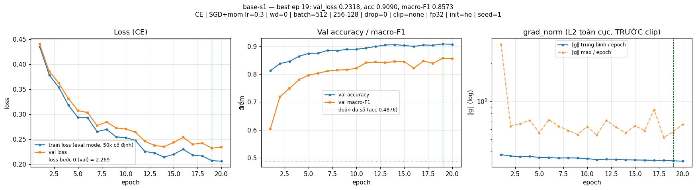

**Hình dạng đường cong baseline:** train và val loss cùng giảm đến cuối (0,44 → 0,21 / 0,23), có răng cưa do lr lớn (lr 0,3, momentum 0,9); khoảng cách val − train chỉ 0,025–0,029 và không nới rộng; best epoch 16–19/20. Đây là **chưa khớp / chưa hội tụ**, không phải quá khớp. Val acc 0,909 ≫ mốc 0,4876. `grad_norm` trung bình giảm chậm 0,38 → 0,34; max có một gai 2,84 ở epoch 1 rồi nằm trong 0,5–0,9.

## 3. Kết quả theo chủ đề

Mọi so sánh ở mục này dùng **val**; Δ là chênh lệch val macro-F1 so với trung bình baseline (0,8607) trừ khi ghi khác. Các thí nghiệm một yếu tố dùng seed 1 — chỉ một lần chạy mỗi cấu hình.

### 3.1 Hàm mất mát — CE vs MSE
- **Dự đoán:** MSE trên logit thua CE về macro-F1 (vượt 2σ), accuracy giảm ít hơn; lr gấp 3 bù được một phần.
- **Kết quả:** `loss-mse` F1 **0,7726** (acc 0,8803), Δ = −0,088; `loss-mse-lr0.9` F1 0,7485, Δ = −0,112 — cả hai vượt xa 2σ. Ở epoch 1, F1 của MSE là 0,484 so với 0,604 của CE. 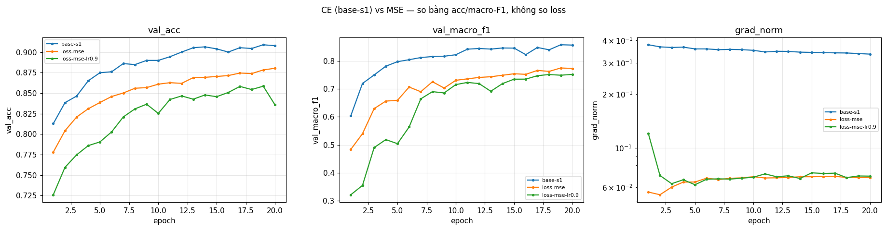
- **Giải thích:** với MSE trung bình trên B·7 phần tử, ∂L/∂z = 2(z − onehot)/(7B); với CE, ∂L/∂z = (softmax(z) − onehot)/B. Ở cùng sai số, gradient MSE nhỏ hơn ~3,5 lần (đo được: grad_norm cuối 0,068 so với 0,336), nên MSE học chậm hơn. Quan trọng hơn, MSE hồi quy mọi logit về đúng 0 hoặc 1: với dữ liệu mất cân bằng, logit của lớp hiếm bị kéo về 0 ở hầu hết mẫu nên ít khi thắng argmax → macro-F1 bị kéo xuống mạnh hơn accuracy (−0,088 so với −0,032). CE thì không phạt logit đúng "quá lớn", chỉ quan tâm thứ tự sau softmax.
- **Khác dự đoán:** tăng lr ×3 làm MSE **tệ hơn**, không tốt hơn — vấn đề không chỉ là thang gradient mà là mục tiêu hồi quy. (Không so độ lớn loss: 0,027 của MSE và 0,23 của CE khác thang đo.)

### 3.2 Bộ tối ưu hoá
- **Dự đoán:** SGD thuần cần lr ~10× SGD+momentum; Adam tốt nhất quanh 1e-3 và nhanh hơn ở các epoch đầu; AdamW (wd 0,01) ≈ Adam; AdamW với wd = 0 trùng Adam.
- **Mỗi bộ ở lr tốt nhất của nó** (3–5 lr mỗi bộ, cách nhau ~3 lần; momentum 0,9; betas (0,9; 0,999), eps 1e-8):

| Bộ tối ưu | exp_id | lr | val macro-F1 | best epoch | Δ vs TB baseline |
|---|---|---|---|---|---|
| SGD | `opt-sgd-lr1` | 1 | 0,8344 | 18 | −0,0263 (vượt 2σ) |
| SGD+momentum | `lr-sgdm-0.3` | 0,3 | 0,8573 | 19 | −0,0034 (trong nhiễu) |
| Adam | `opt-adam-lr0.003` | 0,003 | **0,8677** | 19 | **+0,0070 (vừa vượt 2σ)** |
| AdamW (wd 0,01) | `opt-adamw-lr0.003` | 0,003 | 0,8646 | 18 | +0,0039 (trong nhiễu) |

- **Độ nhạy với lr** (`compare_optimizer_lr.png`): SGD 0,659 → 0,755 → 0,816 → **0,834** → 0,616 (lr 0,03 → 3); Adam 0,788 → 0,846 → **0,868** → 0,864 (3e-4 → 1e-2); SGD+momentum xem mục 2. Adam có vùng lr tốt rộng (3e-3 và 1e-2 cách nhau 0,004), SGD thuần nhạy nhất. 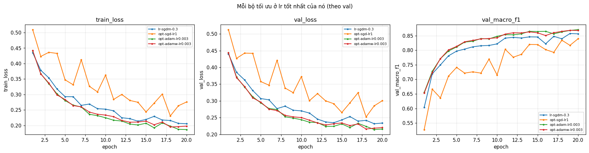 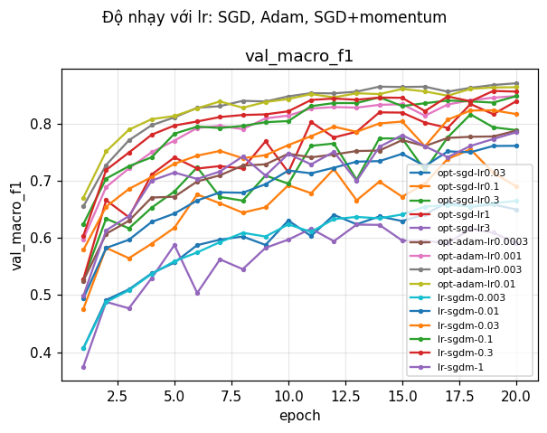
- **Giải thích:** momentum tích luỹ v ≈ g/(1−μ) = 10g khi gradient ổn định, nên SGD thuần cần lr lớn hơn ~3–10 lần để đi cùng quãng đường — đúng là lr tốt nhất của SGD (1) gấp ~3 lần của SGD+momentum (0,3), và vẫn thua vì không có tác dụng làm mượt hướng đi của momentum. Adam chia bước của từng tham số cho √v̂ của chính nó nên các tham số ít được cập nhật (bias của lớp hiếm, trọng số nối với cột one-hot hiếm) vẫn có bước đủ lớn: F1 ở epoch 1 là 0,655 so với 0,604 của SGD+momentum. AdamW thua Adam 0,0031 — trong nhiễu; với wd = 0 thì `opt-adamw-wd0-lr0.003` trùng Adam **từng chữ số** (max |Δ val loss| = 0), khớp công thức: khác biệt duy nhất của AdamW là số hạng −ηλw.
- **Nhiễu:** chỉ Adam vượt 2σ, và vừa sát ngưỡng (0,0070 so với 0,0060) với một seed — coi là bằng chứng yếu.

### 3.3 Hyper-parameter
- **Dự đoán:** batch 128 tốt hơn (gấp 4 bước); batch 2048 kém hơn, lr ×4 bù lại; M-wide tốt hơn, M-deep tốt hơn ít; weight decay không giúp; 40 epoch tốt hơn.

| exp_id | thay đổi | bước/epoch | s/epoch | val F1 | Δ |
|---|---|---|---|---|---|
| `hp-batch128` | batch 128, lr 0,3 | 2 906 | 4,97 | 0,7951 | −0,066 |
| `hp-batch128-lr0.075` | batch 128, lr ÷4 | 2 906 | 5,00 | 0,8647 | +0,004 (nhiễu) |
| `hp-batch2048` | batch 2048, lr 0,3 | 182 | 0,33 | 0,8338 | −0,027 |
| `hp-batch2048-lr1.2` | batch 2048, lr ×4 | 182 | 0,33 | 0,0936 | chết |
| `hp-wide` | 54-512-256-7 | 727 | 1,27 | **0,8747** | **+0,014** |
| `hp-deep` | 54-256-128-64-7 | 727 | 1,38 | 0,8535 | −0,007 |
| `hp-wd1e-4` | weight decay 1e-4 | 727 | 1,28 | 0,8123 | −0,048 |
| `hp-epochs40` | 40 epoch | 727 | 1,25 | **0,8733** | **+0,013** (best ep 32) |

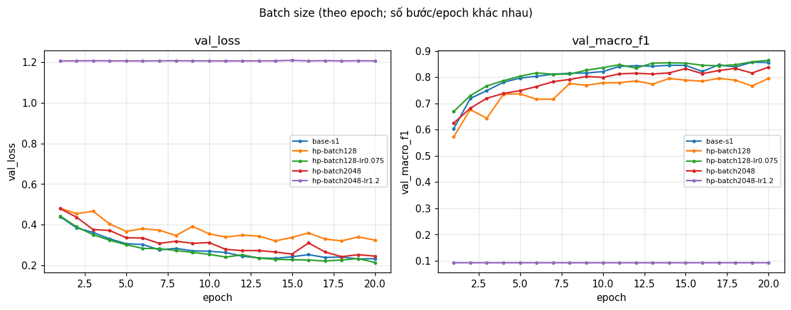 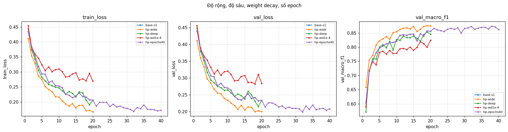

- **Batch và lr đi cùng nhau.** Batch 128 ở lr 0,3 **khác dự đoán**: thêm 4 lần bước nhưng F1 giảm mạnh, best epoch 14 rồi xấu đi. Phương sai của gradient lô tỉ lệ ~1/B, nên lô 128 nhiễu gấp 4 lần lô 512; với lr 0,3 và momentum, nhiễu đó đủ lớn để làm tham số nhảy quanh vùng tốt. Chia lr cho 4 (`hp-batch128-lr0.075`) đưa F1 về 0,8647 — ngang baseline — nhưng mỗi epoch chậm gần 4 lần vì GPU xử lý 2 906 lô nhỏ thay vì 727 lô vừa. Ngược lại, batch 2048 cùng lr chỉ có 182 bước/epoch (ít hơn 4 lần) nên chưa đi đủ xa (−0,027). Nhân lr ×4 theo quy tắc tỉ lệ tuyến tính **mà không khởi động** thì hỏng hẳn: gai ‖g‖ = 14,8 ở epoch 1, mạng rơi vào trạng thái chỉ đoán lớp 1 (cùng cơ chế với mục 3.5). Slide nói "kèm khởi động" — kết quả này cho thấy vì sao.
- **Năng lực.** Baseline chưa khớp, nên thêm độ rộng (161k tham số) giúp vượt nhiễu (+0,014) mà không tốn thời gian đáng kể (1,27 s/epoch, GPU chưa bão hoà). Thêm một lớp 64 nơ-ron (`hp-deep`) không giúp: Δ = −0,007 chỉ vừa qua ngưỡng với một seed, tôi không kết luận "sâu hơn thì tệ hơn", chỉ là "không thấy lợi". Huấn luyện 40 epoch: 20 epoch đầu trùng hệt `base-s1` (cùng seed), sau đó tiếp tục giảm, best epoch 32.
- **Weight decay** 1e-4 với lr 0,3 hại rõ (−0,048): mỗi bước co trọng số theo hệ số (1 − ηλ) trên 14 540 bước, trong khi mô hình đang thiếu năng lực chứ không thừa — chính quy hoá chỉ làm nặng thêm việc chưa khớp.

### 3.4 Dropout
- **Dự đoán:** baseline chưa quá khớp nên dropout không giúp; q = 0,3 hại rõ.
- **Kết quả:** khoảng cách val − train của baseline chỉ 0,025–0,029. `drop-0.1` F1 0,8385 (Δ −0,022), khoảng cách 0,015; `drop-0.3` F1 0,7824 (Δ −0,078), khoảng cách 0,006. Cả hai vượt 2σ theo hướng xấu. 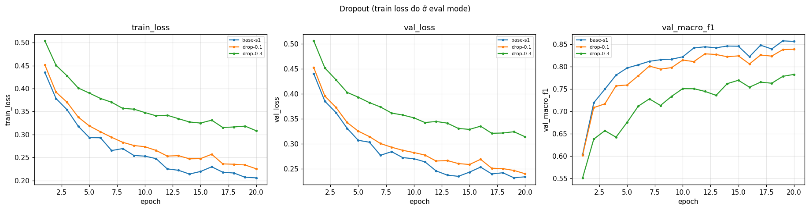
- **Giải thích:** dropout đúng là thu hẹp khoảng cách train–val (0,028 → 0,015 → 0,006) — nhưng bằng cách **đẩy train loss lên** (0,206 → 0,225 → 0,308, đo ở `eval()` nên không phải do nơ-ron bị tắt lúc đo), không phải kéo val xuống. Mỗi bước chỉ huấn luyện một mạng con ngẫu nhiên, gradient nhiễu hơn và năng lực hiệu dụng nhỏ đi, trong khi vấn đề của mô hình là thiếu năng lực. Dropout là thuốc cho quá khớp; ở đây không có bệnh đó.

### 3.5 Gradient clipping
- **Chọn c từ grad_norm baseline:** trung vị của grad_norm trung bình theo epoch của `base-s1` = **c = 0,35**.
- **Dự đoán:** ở lr baseline, clip kích hoạt khoảng nửa số bước, F1 trong nhiễu; ở lr cao, không clip → phân kỳ, có clip → sống sót.
- **Kết quả:**

| exp_id | lr | clip | % bước bị clip | max ‖g‖ epoch 1 | val F1 |
|---|---|---|---|---|---|
| `base-s1` | 0,3 | không | – | 2,8 | 0,8573 |
| `clip-0.35` | 0,3 | 0,35 | 66,6% | 2,8 | 0,8581 (Δ vs base-s1 +0,001, nhiễu) |
| `clip-none-lr0.9` | 0,9 | không | – | 8,1 | 0,7990 |
| `clip-0.35-lr0.9` | 0,9 | 0,35 | 18% ở epoch 1, 1,8% TB | 2,8 | **0,8314 (+0,032 so với không clip)** |
| `clip-none-lr3` | 3 | không | – | **7 813** | 0,0936 (chết) |
| `clip-0.35-lr3` | 3 | 0,35 | 44% ở epoch 1 | 9,4 | 0,1928 (vẫn hỏng) |

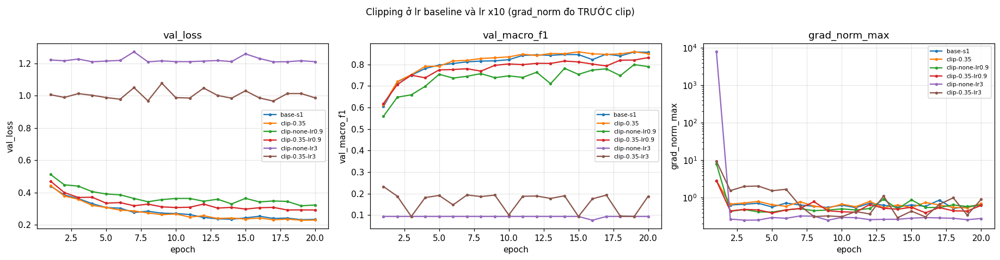

- **Giải thích:** ở lr 0,3 clipping kích hoạt ở 2/3 số bước nhưng chỉ cắt gradient từ ~0,4 về 0,35 — tương đương giảm lr ~10%, F1 không đổi (đúng dự đoán). Ở lr 0,9 (×3), các gai đầu huấn luyện (‖g‖ đến 8,1) nhân với lr lớn tạo ra những bước nhảy xa làm hỏng trọng số; clip chặn mỗi bước ở η·c và giữ được 0,032 F1 — vượt 2σ, đây là tình huống clipping sinh ra để xử lý. Ở lr 3 (×10) **khác dự đoán**: không có NaN, cờ `diverged` = N. Bước đầu với ‖g‖ = 7 813 đẩy trọng số đi xa đến mức hầu hết ReLU tắt vĩnh viễn (tiền kích hoạt âm với mọi đầu vào), gradient sau đó chỉ còn ~0,03–0,08, và mạng chỉ học được bias lớp cuối — val loss kẹt ở **1,205 = entropy của phân phối lớp** (−Σ p_c ln p_c = 1,2052), tức là mô hình đúng bằng "đoán theo tần suất lớp". Clip ngăn được gai nhưng lr 3 vẫn quá lớn ngay cả với bước đã bị chặn. Bài học: clipping chữa *gai*, không chữa lr sai.

### 3.6 Mixed precision
- **Dự đoán:** metric trong nhiễu; không nhanh hơn trên mạng nhỏ; BF16 chậm trên T4; M-wide có thể nhanh hơn chút với FP16.

| exp_id | precision | model | s/epoch | đỉnh bộ nhớ (MB) | val F1 | Δ vs FP32 cùng model |
|---|---|---|---|---|---|---|
| `base-s1` | fp32 | M-base | 1,27 | 17,9 | 0,8573 | – |
| `amp-fp16` | fp16 + GradScaler | M-base | 1,70 | 17,9 | 0,8597 | +0,002 (nhiễu) |
| `amp-bf16` | bf16 | M-base | 1,48 | 17,9 | 0,8520 | −0,005 (nhiễu) |
| `hp-wide` | fp32 | M-wide | 1,27 | 19,7 | 0,8747 | – |
| `amp-fp16-wide` | fp16 + GradScaler | M-wide | 1,69 | 19,7 | 0,8745 | −0,000 (nhiễu) |
| `amp-bf16-wide` | bf16 | M-wide | 1,47 | 19,7 | 0,8760 | +0,001 (nhiễu) |

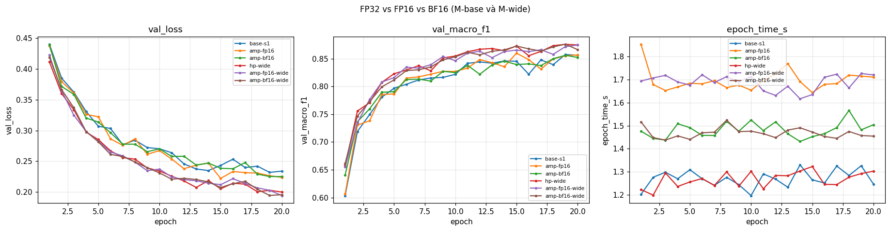

- **Giải thích:** độ chính xác không đổi (mọi Δ trong 2σ), nhưng **FP16 chậm hơn FP32 34%, BF16 chậm hơn 16%**, kể cả trên M-wide — dự đoán "M-wide nhanh hơn" sai. Phép nhân lớn nhất ở đây là (512 × 256)·(256 × 512): quá nhỏ để Tensor Core bù lại chi phí cố định, nên thời gian bị chi phối bởi số lần gọi kernel, và autocast *thêm* kernel (ép kiểu trọng số và kích hoạt mỗi bước), GradScaler thêm nữa (nhân loss, `unscale_`, kiểm tra inf/NaN). BF16 không cần GradScaler nên ít kernel hơn FP16, nhưng T4 không có BF16 phần cứng nên vẫn chậm hơn FP32. Bộ nhớ không đổi: kích hoạt của một lô 512 chỉ ~0,8 MB, nên giảm một nửa không thấy được trong đỉnh ~18 MB; tôi *đoán* phần còn lại là chi phí cố định của bộ cấp phát và workspace cuBLAS — chưa đo trực tiếp.
- **Vì sao FP16 cần nhân loss với s còn BF16 thì không:** FP16 có 5 bit mũ (giá trị dương nhỏ nhất ~6·10⁻⁸, lớn nhất 65 504), nên gradient nhỏ dễ tràn dưới thành 0; nhân loss với s đẩy gradient vào vùng biểu diễn được, rồi chia lại trước khi cập nhật (và trước khi đo/clip ‖g‖). BF16 có 8 bit mũ như FP32 (khoảng ~10⁻³⁸ đến ~3·10³⁸) nên không tràn dưới; nó chỉ mất độ chính xác (7 bit phần định trị).

### 3.7 Khởi tạo tham số
- **Cách đo:** std của tiền kích hoạt sau mỗi `nn.Linear` (trước ReLU) trên 4 096 mẫu val ở bước 0; cột cuối là std của logits. `xavier` = `xavier_normal_` (Var = 2/(n_in+n_out)), không phải 1/n_in của slide.

| init | std sau L1 | std sau L2 | std logits | loss bước 0 | val F1 (exp_id) |
|---|---|---|---|---|---|
| he | 0,661 | 0,640 | 0,577 | 2,269 | 0,8573 (`base-s1`) |
| xavier | 0,276 | 0,218 | 0,192 | 2,022 | 0,8502 (`init-xavier`) |
| default | 0,274 | 0,113 | 0,059 | 1,983 | 0,8637 (`init-default`) |
| normal(0; 0,01) | 0,034 | 0,0038 | 0,0003 | 1,946 | 0,8609 (`init-normal`) |
| zeros | 0 | 0 | 0 | 1,9459 | 0,0936 (`init-zeros`) |

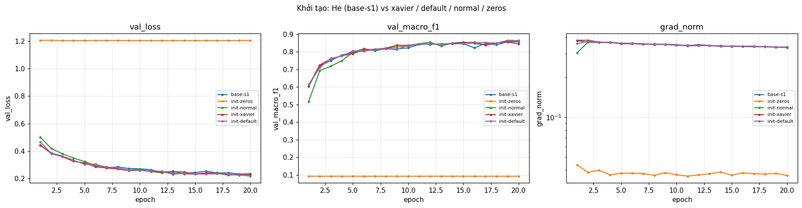

- **Dự đoán và đối chiếu.** `zeros`: dự đoán mạng chỉ học được tần suất lớp — **đúng chính xác**. Ở bước 0, mọi gradient bằng **0 tuyệt đối** trừ ‖∇b3‖ = 0,484: tiền kích hoạt = 0, ReLU(0) = 0 nên h1 = h2 = 0, ∂L/∂W3 = h2ᵀδ = 0; ∂L/∂h2 = δW3ᵀ = 0 vì W3 = 0, nên W2, W1 cũng không nhận gì. Vì chỉ b3 thay đổi, W luôn bằng 0 và trạng thái này không bao giờ thoát ra — tệ hơn cả vấn đề đối xứng thông thường. Sau 20 epoch ‖W1‖ = ‖W2‖ = ‖W3‖ = 0, mạng chỉ đoán lớp 1, và softmax(b3) = (0,359; 0,494; 0,061; 0,005; 0,016; 0,031; 0,035) — gần đúng tỉ lệ lớp trong train (0,365; 0,488; 0,062; 0,005; 0,016; 0,030; 0,035); val loss = 1,205 = entropy của tỉ lệ lớp.
- `normal(0; 0,01)`: tín hiệu co ~10 lần mỗi lớp (0,034 → 0,0038 → 0,0003), logits ≈ 0 nên loss bước 0 = ln 7 gần như tuyệt đối. Khởi đầu chậm (F1 epoch 1: 0,517 so với 0,604 của He) nhưng bắt kịp sau 20 epoch (0,8609, trong nhiễu) — đúng dự đoán. Mạng chỉ 3 lớp: tín hiệu co 100 lần ở logits vẫn chưa đến mức mất hẳn, và SGD+momentum với lr 0,3 khuếch đại nhanh các trọng số. Biểu đồ "30 lớp ReLU" của slide cần độ sâu lớn hơn nhiều để thấy rõ.
- `default` (Var = 1/(3·n_in), nhỏ hơn He 6 lần) và `normal` trong nhiễu so với He. `xavier` thấp hơn 0,0105 so với TB baseline (vượt 2σ) nhưng chỉ thấp hơn `base-s1` cùng seed 0,007; với một seed và mạng 3 lớp, tôi **không** kết luận Xavier kém He ở đây.
- **He vs Xavier:** ReLU giết một nửa phân phối nên E[ReLU(z)²] = Var(z)/2. He bù đúng hệ số 2 đó (Var = 2/n_in) để phương sai giữ nguyên qua mỗi lớp; Xavier (thiết kế cho tanh/tuyến tính) không bù đủ, nên tín hiệu co dần qua mỗi lớp — đo được tỉ số std giữa hai lớp liên tiếp ≈ 0,8–0,9 (0,276 → 0,218 → 0,192), trong khi He giữ ≈ 1 (0,661 → 0,640). Ở 3 lớp khác biệt không đáng kể; ở mạng hàng chục lớp, hệ số đó luỹ thừa lên và tín hiệu/gradient tiêu biến.

## 4. Đánh giá cuối trên tập eval

**Cấu hình cuối, chọn chỉ bằng val.** Chỉ hai thay đổi đơn lẻ tăng F1 vượt nhiễu và cùng một chẩn đoán "chưa khớp": `hp-wide` (+0,014) và `hp-epochs40` (+0,013); thêm Adam ở lr tốt nhất (+0,007). Vòng chọn cuối trên val (seed 1): `final-cand-sgdm` (M-wide + 40 epoch + SGD+momentum lr 0,3) val F1 0,8952 vs `final-cand-adam` (M-wide + 40 epoch + Adam lr 0,003) **0,9052** → chọn Adam. Ba seed của cấu hình cuối: val F1 0,9052 / 0,9080 / 0,9112 = **0,9081 ± 0,0030**, hơn baseline +0,047 — gấp ~8 lần 2σ. Dropout, weight decay, clipping, AMP, init khác He không vào vì không tăng F1 vượt nhiễu. Cấu hình cuối đổi nhiều yếu tố cùng lúc (ghi trong `notes`).

| Cấu hình | Seed nộp | val macro-F1 | **eval macro-F1** | eval accuracy |
|---|---|---|---|---|
| Baseline (`base-s1`: M-base, SGD+momentum lr 0,3, 20 epoch, best ep 19) | 1 | 0,8573 | **0,8565** | 0,9089 |
| Cấu hình cuối (`final-s1`: M-wide, Adam lr 0,003, 40 epoch, best ep 33) — **file nộp** | 1 | 0,9052 | **0,9072** | 0,9394 |

- Số của `final-s1` lấy từ `eval_result.json`; của `base-s1` từ `eval_extra/eval_result_base-s1.json`, đều do `scripts/evaluate.py` ghi.
- **Nhiễu của điểm eval** (cùng script, cho các seed còn lại của hai cấu hình này, sau khi đã chốt cấu hình và seed nộp): baseline 0,8565 / 0,8620 / 0,8614 = 0,8600 ± 0,0030; cấu hình cuối 0,9072 / 0,9044 / 0,9130 = 0,9082 ± 0,0044. Cải thiện **+0,048**, vượt xa nhiễu seed của cả hai.
- **Val và eval rất gần nhau:** chênh lệch ≤ 0,0036 ở cả 6 mô hình (ví dụ `final-s1` 0,9052 val vs 0,9072 eval) — phù hợp với việc val được tách phân tầng từ cùng phân phối, và không có lựa chọn nào dựa trên eval để "quá khớp" vào nó.

### 4.1 Phân tích lỗi theo lớp (`final-s1`, từ `eval_result.json`)

| Lớp | support | precision | recall | F1 |
|---|---|---|---|---|
| 0 Spruce/Fir | 42 368 | 0,9398 | 0,9334 | 0,9366 |
| 1 Lodgepole Pine | 56 661 | 0,9453 | 0,9515 | 0,9484 |
| 2 Ponderosa Pine | 7 151 | 0,9504 | 0,9291 | 0,9396 |
| 3 Cottonwood/Willow | 549 | 0,8470 | 0,8470 | 0,8470 |
| 4 Aspen | 1 899 | 0,8436 | 0,8462 | **0,8449** |
| 5 Douglas-fir | 3 473 | 0,8641 | 0,9171 | 0,8898 |
| 6 Krummholz | 4 102 | 0,9609 | 0,9278 | 0,9441 |

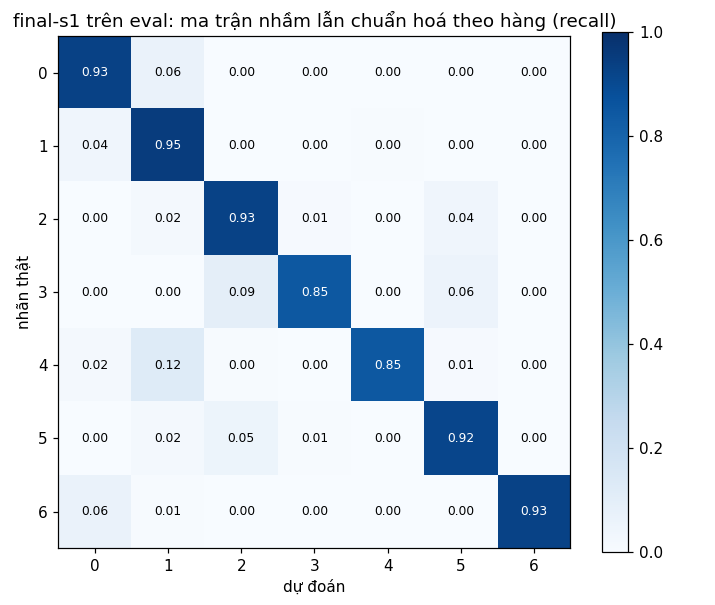

- **Lớp khó nhất là lớp 4 — Aspen (F1 = 0,8449),** sát sau là lớp 3 Cottonwood/Willow (0,8470). Aspen hay bị nhầm sang **lớp 1 Lodgepole Pine**: 236/1 899 = 12,4% mẫu Aspen thật bị đoán là Lodgepole, và chiều ngược lại 237 mẫu Lodgepole bị đoán là Aspen. Cottonwood/Willow bị nhầm sang lớp 2 Ponderosa Pine (52/549 = 9,5%).
- **Ma trận cho thấy (đo được):** Aspen chỉ chiếm 1,6% train (≈ 6 080 mẫu) so với 48,8% của Lodgepole — tỉ lệ ~1 : 30; mỗi nhầm lẫn giữa hai lớp gần bằng nhau về số mẫu nhưng chiếm 12% của Aspen và chỉ 0,4% của Lodgepole, nên chỉ F1 của Aspen bị kéo xuống. Về trung bình đặc trưng trên train, Aspen nằm thấp hơn (độ cao 2 788 m vs 2 921 m) và gần đường/điểm cháy hơn (1 353 vs 2 432 m; 1 580 vs 2 168 m), nhưng các khoảng này chồng lấn nhau rộng.
- **Giả thuyết (chưa kiểm chứng):** Aspen thường mọc xen trong cùng dải độ cao với Lodgepole Pine, nên trong không gian 10 biến địa hình + loại đất, nhiều ô Aspen không tách được khỏi Lodgepole; cộng với mất cân bằng 1 : 30, CE không trọng số ưu tiên đoán lớp lớn ở vùng chồng lấn. Cải thiện sẽ thử: CE có trọng số theo lớp (hoặc lấy mẫu lại lớp hiếm) và chọn bằng macro-F1 trên val. Cấu hình cuối đã cải thiện nhiều nhất chính ở các lớp nhỏ: F1 của Aspen tăng 0,7595 → 0,8449 so với `base-s1`.

## 5. Trả lời các câu hỏi dẫn dắt

1. **Bộ tối ưu nào "thắng" khi lr được chỉnh công bằng?** Adam (lr 3e-3, F1 0,8677) > AdamW (0,8646) ≈ SGD+momentum (0,8573) > SGD (0,8344). Chỉ Adam vượt 2σ so với baseline, và vừa sát ngưỡng. **Khi không chỉnh lr thì kết luận lật ngược tuỳ lr được chọn:** Adam ở 3e-4 (0,7877) thua SGD+momentum ở 0,3 tới 0,07; SGD+momentum ở 0,01 (0,7613) lại thua Adam ở 3e-3 tới 0,11. So hai bộ tối ưu ở một lr chung là so lr, không phải so bộ tối ưu.
2. **Dropout có giúp khi mô hình chưa quá khớp không?** Không: −0,022 (q = 0,1) và −0,078 (q = 0,3), đều vượt 2σ. Nó thu hẹp khoảng cách train–val bằng cách làm train tệ đi. Nên dùng khi val loss bắt đầu tăng trong khi train loss còn giảm (khoảng cách nới rộng) — điều chưa xảy ra trong 20–40 epoch ở đây.
3. **Gradient clipping giải quyết vấn đề gì?** Các bước cập nhật quá lớn do gai gradient. Bằng chứng: ở lr 0,9, gai ‖g‖ = 8,1 ở epoch 1 khi không clip; clip c = 0,35 (bị kích hoạt ở 18% bước epoch 1) giữ F1 0,8314 so với 0,7990 (+0,032, vượt 2σ). Ở lr bình thường nó không làm gì đáng kể (F1 trong nhiễu dù cắt 2/3 số bước); ở lr quá lớn (3) nó không cứu được — clipping chặn độ dài từng bước, không sửa một lr sai.
4. **Mixed precision có làm nhanh hơn không?** Không: FP16 chậm hơn 34%, BF16 chậm hơn 16% trên T4, metric và bộ nhớ không đổi. Mạng quá nhỏ để Tensor Core có lợi; autocast và GradScaler thêm kernel; T4 không có BF16 phần cứng. Mixed precision có lợi khi phép nhân ma trận lớn (mạng rộng/sâu, lô lớn) và kích hoạt chiếm phần lớn bộ nhớ.
5. **Vì sao khởi tạo toàn 0 hỏng? He khác Xavier ở đâu?** Với W = 0 và ReLU(0) = 0, mọi kích hoạt ẩn bằng 0 nên mọi gradient của W bằng 0 (đo được: chính xác 0,0), chỉ b3 học → mạng hội tụ về tần suất lớp (val loss = 1,205 = entropy tỉ lệ lớp, acc 0,4876). Kể cả với bias ≠ 0, các nơ-ron cùng lớp vẫn nhận gradient giống hệt nhau (đối xứng) và mãi là bản sao của nhau. He dùng Var = 2/n_in để bù việc ReLU bỏ một nửa phân phối; Xavier dùng 2/(n_in+n_out) (hoặc 1/n_in), không bù hệ số 2 nên tín hiệu co lại sau mỗi lớp ReLU (đo được ~0,8–0,9 lần mỗi lớp ở đây). Điều đó quan trọng ở mạng sâu (hệ số luỹ thừa theo số lớp); ở mạng 3 lớp này khác biệt nằm trong mức một seed.
6. **Loss không giảm sau 2 000 bước: 3 phép kiểm tra đầu tiên.**
   1. **Loss bước 0 và *giá trị* mà loss kẹt lại.** Bước 0 phải ≈ ln 7 = 1,946 (lệch nhiều → logit lớn / thiếu chuẩn hoá / nhãn sai hệ 0..6). Nếu loss kẹt ở ≈ 1,205 thì đó là entropy của tỉ lệ lớp — mô hình chỉ học được bias lớp cuối, phần còn lại của mạng không nhận gradient (thấy ở `init-zeros`, `clip-none-lr3`, `hp-batch2048-lr1.2`). Kẹt ở ≈ 1,946 thì mạng chưa học được gì kể cả tần suất lớp → nghi lr ≈ 0 hoặc optimizer không có tham số.
   2. **Quá khớp một lô nhỏ (20 mẫu, tắt mọi chính quy hoá).** Nếu không về ~0 (ở đây: 0,000177 sau 500 bước) thì lỗi nằm trong code — nhãn lệch, softmax hai lần, quên `zero_grad`, tham số không nằm trong optimizer — chứ không phải năng lực mô hình hay dữ liệu.
   3. **‖gradient‖ từng tham số và grad_norm toàn cục theo thời gian.** Gradient bằng 0 ở các lớp đầu (như `zeros`) → gradient không chảy; grad_norm có gai rất lớn ở đầu rồi sụp về ~0,03–0,08 (như `clip-none-lr3`: 7 813 → 0,08) → lr quá lớn đã làm ReLU chết, giảm lr 3–10 lần hoặc thêm clip/khởi động. Gai nhỏ nhưng loss dao động → giảm lr.

   Ba phép này rẻ (vài giây) và tách được ba nhóm nguyên nhân của câu hỏi: dữ liệu/nhãn (1), code vòng lặp (2), và động học tối ưu/kiến trúc (3).

## 6. Hạn chế và điều bất ngờ

- **Khác dự đoán:** batch 128 ở cùng lr tệ hơn chứ không tốt hơn (nhiễu gradient tăng ~4 lần); lr ×10 không cho NaN mà làm ReLU chết, nên cờ `diverged` không bắt được thất bại này — chỉ grad_norm và val loss = 1,205 lộ ra nó; MSE với lr ×3 tệ hơn; mixed precision chậm hơn kể cả với M-wide; M-deep không giúp.
- **Nhiễu:** σ ước lượng từ 3 seed baseline (rất thô); mọi thí nghiệm một yếu tố chỉ có 1 seed. Các kết luận sát ngưỡng (Adam +0,0070, `hp-deep` −0,0072, `init-xavier` −0,0105) là bằng chứng yếu; các kết luận lớn (MSE, dropout, weight decay, batch, wide, epoch, clip ở lr 0,9, zeros) vượt ngưỡng nhiều lần.
- **Thiết kế:** baseline 20 epoch chưa hội tụ (best epoch 16–19), nên mọi so sánh 20 epoch phần nào là so *tốc độ* chứ không phải *điểm hội tụ* — đây là lý do 40 epoch và Adam đều có lợi. Batch khác nhau nghĩa là số bước khác nhau ở cùng số epoch (ghi ở bảng 3.3). Cấu hình cuối đổi 3 yếu tố cùng lúc; tôi không tách đóng góp riêng của từng yếu tố trong tổ hợp (chỉ có bằng chứng riêng lẻ ở 20 epoch).
- **Quy trình:** có một lần chạy thăm dò trên Kaggle (chỉ Part 0–3, chỉ val) trước lần chạy chính. Vì lr tốt nhất của SGD+momentum, SGD, Adam, AdamW khi đó nằm ở biên lưới, lưới lr được nới (thêm 1; 3; 1e-2) và thêm `hp-batch128-lr0.075`, cặp clip ở lr ×3 — các mục này được đánh dấu "thêm sau lần thăm dò đầu" trong notebook. Eval chỉ được dùng ở Part 4, cho baseline và cấu hình cuối (3 seed mỗi bên để đo nhiễu); file nộp là `final-s1`, chốt trước khi chạy eval.
- **Đo lường:** peak memory không phân biệt được FP32/FP16/BF16 ở quy mô này (giả thuyết về nguyên nhân ở 3.6, chưa đo); thời gian đo trên một loại GPU (T4).
- **Nếu có thêm thời gian:** CE có trọng số lớp cho Aspen/Cottonwood; lịch lr cosine + khởi động cho Adam và để thử lại quy tắc tỉ lệ tuyến tính ở batch 2048; nhiều seed hơn cho các kết quả sát ngưỡng; mạng sâu hơn nhiều để thấy khác biệt He/Xavier/normal như slide.

## 7. Phụ lục

- **File đã nộp:** `REPORT.md`, `experiments.xlsx` (52 dòng; sheet Seeds = `base-s1..3`; Summary có nhận xét), `predictions_eval.csv` (`final-s1`, 116 203 dòng), `eval_result.json`, `figures/` (52 ảnh `<exp_id>.png` + 13 ảnh `compare_*.png`), `results/` (52 file JSON), `eval_extra/` (eval_result của `base-s1..3`, `final-s2..3`; CSV dự đoán của các mô hình này không đưa lên git), `code/` (`lab.ipynb` có output từ Kaggle + 6 module).
- **Thời gian chạy:** ≈ 1 662 s huấn luyện (tổng `epoch_time_s` của 52 lần chạy) trên một T4, cộng đánh giá mỗi epoch; cả notebook ≈ 40 phút.
